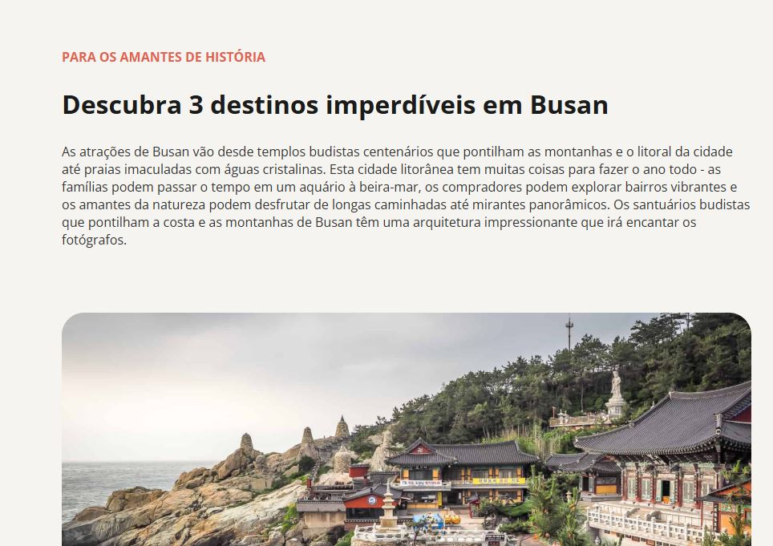

# Local Turístico - Busan

## Sobre o projeto

Este projeto foi desenvolvido como parte do meu aprendizado na Formação Fullstack da Rocketseat, durante os estudos de HTML e CSS. Foi o primeiro projeto que desenvolvi sozinha, colocando em prática os conceitos aprendidos e fortalecendo minha base para os próximos desafios da formação.

## Conhecimentos adquiridos:

- Estrutura semântica do HTML;
- Títulos e parágrafos;
- Listas;
- Imagens e atributos;
- Classes e seletores CSS;
- Cores;
- Tipografia;
- Margens e espaçamentos;
- padding;
- Bordas arredondadas com border-radius;
- Organização e estilização de elementos;
- Importação de fontes externas com Google Fonts;

## Tecnologias utilizadas

- HTML
- CSS
- Git
- GitHub
- Live Server
- VsCode

## 📸 Preview

⭐ Este projeto representa um dos primeiros passos da minha jornada no desenvolvimento Fullstack.